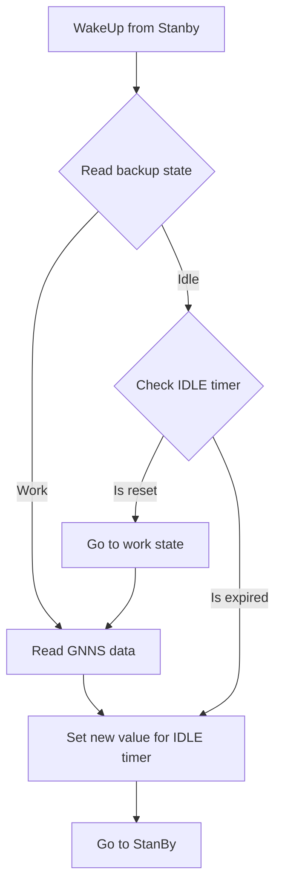

# Motion Detection Algorithm

```mermaid
    flowchart TD

    s[WakeUp from Stanby] --> detection{Read backup state}
    detection -->|Work| read[Read GNNS data]
    detection -->|Idle| check{Check IDLE timer}
    check -->|Is reset| prepared[Go to work state]
    check -->|Is expired| set_timer[Set new value for IDLE timer]

    to_sleep[Go to StanBy]
    prepared --> read--> set_timer -->to_sleep
```
